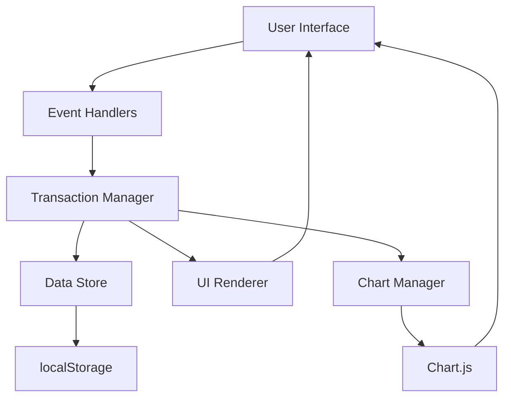
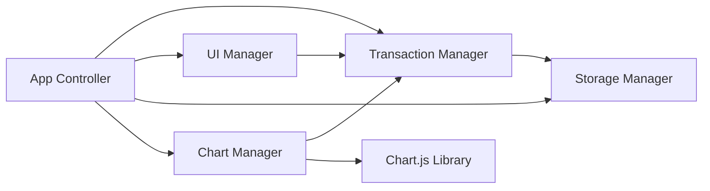

# Design Document: Expense Budget Visualizer

## Overview

Aplikasi Visualisasi Pengeluaran & Anggaran adalah aplikasi web single-page berbasis klien yang dibangun dengan vanilla JavaScript, HTML, dan CSS. Aplikasi ini memungkinkan pengguna untuk melacak pengeluaran mereka melalui antarmuka yang intuitif dengan visualisasi data menggunakan Chart.js.

### Key Design Principles

1. **Client-Side Architecture**: Semua logika aplikasi berjalan di browser tanpa memerlukan backend server
2. **Data Persistence**: Menggunakan localStorage API untuk menyimpan data secara persisten
3. **Reactive UI**: UI secara otomatis update ketika data berubah
4. **Separation of Concerns**: Memisahkan logika data, UI rendering, dan event handling
5. **Progressive Enhancement**: Fitur opsional dapat ditambahkan tanpa mengubah core functionality

### Technology Stack

- **HTML5**: Struktur markup aplikasi
- **CSS3**: Styling dan layout responsif
- **Vanilla JavaScript (ES6+)**: Logika aplikasi tanpa framework
- **Chart.js**: Library untuk rendering pie chart
- **localStorage API**: Persistensi data di browser

## Architecture

### High-Level Architecture

Aplikasi menggunakan arsitektur berbasis komponen dengan pola MVC (Model-View-Controller) yang disederhanakan:



### Component Architecture



### Data Flow

1. **User Input** → Event Handler → Transaction Manager → Storage Manager → localStorage
2. **Data Change** → Transaction Manager → UI Manager → DOM Update
3. **Data Change** → Transaction Manager → Chart Manager → Chart.js → Canvas Update
4. **App Load** → Storage Manager → localStorage → Transaction Manager → UI Manager + Chart Manager

## Components and Interfaces

### 1. Transaction Manager

**Responsibility**: Mengelola state transaksi dan business logic

**Interface**:
```javascript
class TransactionManager {
  constructor(storageManager, uiManager, chartManager)
  
  // Core operations
  addTransaction(name, amount, category): Transaction
  deleteTransaction(id): boolean
  getTransactions(): Transaction[]
  getTotalBalance(): number
  getCategoryTotals(): Map<string, number>
  
  // Initialization
  loadTransactions(): void
  
  // Observers
  notifyObservers(): void
}
```

**Key Behaviors**:
- Maintains in-memory array of transactions
- Generates unique IDs for new transactions
- Validates transaction data before adding
- Notifies observers (UI and Chart) when data changes
- Delegates persistence to StorageManager

### 2. Storage Manager

**Responsibility**: Menangani serialization dan persistence ke localStorage

**Interface**:
```javascript
class StorageManager {
  constructor(storageKey)
  
  // Persistence operations
  save(transactions): void
  load(): Transaction[]
  clear(): void
  
  // Serialization
  serialize(transactions): string
  deserialize(jsonString): Transaction[]
}
```

**Key Behaviors**:
- Serializes transactions to JSON format
- Handles localStorage API calls
- Provides error handling for storage quota exceeded
- Returns empty array if no data exists

### 3. UI Manager

**Responsibility**: Mengelola rendering dan update DOM

**Interface**:
```javascript
class UIManager {
  constructor(transactionManager, categoryManager, thresholdManager)
  
  // Rendering
  renderTransactionList(transactions): void
  renderTotalBalance(total): void
  renderEmptyState(): void
  renderCategoryDropdown(categories): void
  renderCustomCategoryList(customCategories): void
  
  // Form handling
  clearForm(): void
  showValidationError(field, message): void
  clearValidationErrors(): void
  
  // Event binding
  bindAddTransaction(handler): void
  bindDeleteTransaction(handler): void
  bindAddCustomCategory(handler): void
  bindDeleteCustomCategory(handler): void
  bindSetThreshold(handler): void
  
  // Highlighting
  applyThresholdHighlighting(transactionElement, amount): void
}
```

**Key Behaviors**:
- Creates and updates DOM elements
- Formats currency values
- Handles form validation display
- Binds event listeners to UI elements
- Provides smooth transitions for list updates
- Renders category dropdown with default and custom categories
- Applies visual highlighting to transactions above threshold
- Manages custom category UI (add/delete)

### 4. Chart Manager

**Responsibility**: Mengelola Chart.js instance dan update visualisasi

**Interface**:
```javascript
class ChartManager {
  constructor(canvasElement, transactionManager)
  
  // Chart operations
  initializeChart(): void
  updateChart(categoryTotals): void
  destroyChart(): void
  
  // Data preparation
  preparePieChartData(categoryTotals): ChartData
  getCategoryColors(): Map<string, string>
}
```

**Key Behaviors**:
- Initializes Chart.js pie chart instance
- Updates chart data when transactions change
- Handles empty state (no data)
- Assigns consistent colors to categories
- Calculates percentages for display

### 5. Form Validator

**Responsibility**: Validasi input formulir

**Interface**:
```javascript
class FormValidator {
  // Validation methods
  validateName(name): ValidationResult
  validateAmount(amount): ValidationResult
  validateCategory(category): ValidationResult
  validateForm(name, amount, category): ValidationResult
}
```

**Key Behaviors**:
- Validates required fields
- Validates amount is positive number
- Validates category is one of allowed values
- Returns validation result with error messages

### 6. App Controller

**Responsibility**: Koordinasi antar komponen dan initialization

**Interface**:
```javascript
class AppController {
  constructor()
  
  // Lifecycle
  initialize(): void
  
  // Event handlers
  handleAddTransaction(event): void
  handleDeleteTransaction(id): void
}
```

**Key Behaviors**:
- Initializes all managers
- Binds event handlers
- Coordinates data flow between components
- Handles app lifecycle

### 7. Category Manager

**Responsibility**: Mengelola kategori default dan kategori khusus

**Interface**:
```javascript
class CategoryManager {
  constructor(storageManager)
  
  // Category operations
  addCustomCategory(name, color): CustomCategory
  deleteCustomCategory(name): boolean
  getAllCategories(): string[]
  getCustomCategories(): CustomCategory[]
  getCategoryColor(name): string
  isCategoryInUse(name): boolean
  
  // Validation
  validateCategoryName(name): ValidationResult
  
  // Initialization
  loadCustomCategories(): void
}
```

**Key Behaviors**:
- Maintains list of custom categories
- Validates category names (non-empty, unique)
- Prevents deletion of categories in use
- Assigns colors to custom categories
- Persists custom categories to storage
- Merges default and custom categories

### 8. Threshold Manager

**Responsibility**: Mengelola batas pengeluaran untuk highlighting

**Interface**:
```javascript
class ThresholdManager {
  constructor(storageManager)
  
  // Threshold operations
  setThreshold(value): void
  getThreshold(): number | null
  clearThreshold(): void
  isAboveThreshold(amount): boolean
  
  // Initialization
  loadThreshold(): void
}
```

**Key Behaviors**:
- Stores expense threshold value
- Validates threshold is positive number or null
- Provides method to check if amount exceeds threshold
- Persists threshold to storage
- Loads threshold on initialization

## Data Models

### Transaction Model

```javascript
interface Transaction {
  id: string;           // Unique identifier (UUID or timestamp-based)
  name: string;         // Item name (non-empty string)
  amount: number;       // Positive number with up to 2 decimal places
  category: Category;   // One of default categories or custom category
  timestamp: number;    // Creation timestamp (milliseconds since epoch)
}
```

**Constraints**:
- `id`: Must be unique across all transactions
- `name`: Non-empty string, trimmed of whitespace
- `amount`: Positive number (> 0), stored as float
- `category`: Must be one of the valid categories (default or custom)
- `timestamp`: Used for ordering and future date-based features

### Category Enum

```javascript
const DEFAULT_CATEGORIES = {
  FOOD: 'Makanan',
  TRANSPORT: 'Transportasi',
  ENTERTAINMENT: 'Hiburan'
};
```

**Note**: Custom categories are stored separately and merged with default categories at runtime.

### Custom Category Model

```javascript
interface CustomCategory {
  name: string;         // Category name (non-empty, unique)
  color: string;        // Hex color code for chart display
  createdAt: number;    // Creation timestamp
}
```

**Constraints**:
- `name`: Non-empty string, must be unique across all categories (default + custom)
- `color`: Valid hex color code (e.g., '#FF5733')
- `createdAt`: Timestamp for ordering

### Expense Threshold Model

```javascript
interface ExpenseThreshold {
  value: number | null;  // Threshold amount (null means no threshold set)
}
```

**Constraints**:
- `value`: Positive number or null
- When null, no highlighting is applied

### Validation Result Model

```javascript
interface ValidationResult {
  isValid: boolean;
  errors: {
    name?: string;
    amount?: string;
    category?: string;
  };
}
```

### Chart Data Model

```javascript
interface ChartData {
  labels: string[];      // Category names
  datasets: [{
    data: number[];      // Amounts per category
    backgroundColor: string[];  // Colors per category
    borderWidth: number;
  }];
}
```

### Storage Format

Data disimpan di localStorage dengan beberapa keys:

**Key: `expense-transactions`** - Daftar transaksi dalam format JSON:

```json
[
  {
    "id": "1234567890123",
    "name": "Nasi Goreng",
    "amount": 25000,
    "category": "Makanan",
    "timestamp": 1704067200000
  },
  {
    "id": "1234567890124",
    "name": "Bensin",
    "amount": 50000,
    "category": "Transportasi",
    "timestamp": 1704070800000
  }
]
```

**Key: `expense-custom-categories`** - Daftar kategori khusus dalam format JSON:

```json
[
  {
    "name": "Kesehatan",
    "color": "#4CAF50",
    "createdAt": 1704067200000
  },
  {
    "name": "Pendidikan",
    "color": "#2196F3",
    "createdAt": 1704070800000
  }
]
```

**Key: `expense-threshold`** - Batas pengeluaran dalam format JSON:

```json
{
  "value": 100000
}
```


## Correctness Properties

*A property is a characteristic or behavior that should hold true across all valid executions of a system—essentially, a formal statement about what the system should do. Properties serve as the bridge between human-readable specifications and machine-verifiable correctness guarantees.*

### Property 1: Transaction Creation Preserves Data

*For any* valid transaction data (non-empty name, positive amount, valid category), when a transaction is created, the stored transaction SHALL contain exactly the same name, amount, and category values that were provided.

**Validates: Requirements 1.3, 1.5**

### Property 2: Form Clearing After Submission

*For any* valid transaction submission, after the transaction is successfully added, all form input fields (name, amount, category) SHALL be empty or reset to their default state.

**Validates: Requirements 1.4**

### Property 3: Validation Rejects Invalid Inputs

*For any* invalid transaction data (empty/whitespace-only name, non-positive amount, or missing category), the validation SHALL reject the input and prevent transaction creation.

**Validates: Requirements 2.1, 2.4**

### Property 4: Validation Accepts Valid Inputs

*For any* valid transaction data (non-empty trimmed name, positive amount, valid category), the validation SHALL accept the input and allow transaction creation.

**Validates: Requirements 2.5**

### Property 5: Transaction List Displays Complete Data

*For any* transaction in the system, the rendered transaction list SHALL display the transaction's name, amount (formatted as currency), category, and a delete button.

**Validates: Requirements 3.1, 3.4, 4.1**

### Property 6: Currency Formatting Consistency

*For any* numeric amount, when displayed in the UI (transaction list or total balance), the amount SHALL be formatted with exactly two decimal places.

**Validates: Requirements 3.5, 5.5**

### Property 7: Total Balance Calculation Correctness

*For any* set of transactions, the displayed total balance SHALL equal the sum of all transaction amounts, and SHALL update correctly when transactions are added or removed.

**Validates: Requirements 5.2, 5.3, 5.4, 4.3**

### Property 8: Transaction Deletion Removes From List

*For any* transaction in the system, when that transaction is deleted, it SHALL no longer appear in the transaction list or be included in any calculations.

**Validates: Requirements 4.2**

### Property 9: localStorage Persistence

*For any* transaction operation (add or delete), the change SHALL be immediately persisted to localStorage, such that the localStorage data reflects the current transaction state.

**Validates: Requirements 7.1, 7.2, 4.5**

### Property 10: localStorage Loading Restores State

*For any* set of transactions stored in localStorage, when the application loads, all transactions SHALL be restored with their complete data (id, name, amount, category, timestamp).

**Validates: Requirements 7.3**

### Property 11: JSON Serialization Round-Trip

*For any* transaction, serializing it to JSON and then deserializing SHALL produce a transaction with equivalent data (same id, name, amount, category, timestamp).

**Validates: Requirements 7.5**

### Property 12: Custom Category Uniqueness

*For any* custom category name, when adding a custom category, the system SHALL reject the addition if a category with the same name already exists (case-insensitive comparison).

**Validates: Requirements 12.3**

### Property 13: Custom Category Persistence

*For any* custom category added, the category SHALL be persisted to localStorage and SHALL be available after application reload.

**Validates: Requirements 12.5, 12.6**

### Property 14: Category Deletion Protection

*For any* custom category that is used by at least one transaction, the system SHALL prevent deletion of that category.

**Validates: Requirements 12.8**

### Property 15: Threshold Highlighting Consistency

*For any* transaction with amount greater than the threshold value, the transaction SHALL be visually highlighted in the transaction list.

**Validates: Requirements 13.4, 13.5**

### Property 16: Threshold Persistence

*For any* threshold value set by the user, the value SHALL be persisted to localStorage and SHALL be restored after application reload.

**Validates: Requirements 13.2, 13.3**

## Error Handling

### Input Validation Errors

**Error Type**: Invalid Form Input

**Scenarios**:
1. Empty or whitespace-only name field
2. Empty amount field
3. Non-positive amount (zero or negative)
4. No category selected

**Handling Strategy**:
- Prevent form submission
- Display inline error message next to the invalid field
- Keep form data intact (don't clear valid fields)
- Use red text or border to highlight invalid fields
- Clear error messages when user corrects the input

**Implementation**:
```javascript
// Example error display
showValidationError(field, message) {
  const errorElement = document.getElementById(`${field}-error`);
  errorElement.textContent = message;
  errorElement.style.display = 'block';
  
  const inputElement = document.getElementById(field);
  inputElement.classList.add('input-error');
}
```

### localStorage Errors

**Error Type**: Storage Quota Exceeded

**Scenario**: localStorage is full (typically 5-10MB limit)

**Handling Strategy**:
- Catch `QuotaExceededError` exception
- Display user-friendly error message
- Suggest clearing old transactions
- Prevent data loss by keeping in-memory state

**Implementation**:
```javascript
try {
  localStorage.setItem(STORAGE_KEY, JSON.stringify(transactions));
} catch (e) {
  if (e.name === 'QuotaExceededError') {
    alert('Penyimpanan penuh. Silakan hapus beberapa transaksi lama.');
  }
}
```

**Error Type**: localStorage Not Available

**Scenario**: Browser in private mode or localStorage disabled

**Handling Strategy**:
- Detect localStorage availability on app initialization
- Display warning message to user
- Allow app to function with in-memory storage only
- Warn that data will be lost on page refresh

**Implementation**:
```javascript
function isLocalStorageAvailable() {
  try {
    const test = '__storage_test__';
    localStorage.setItem(test, test);
    localStorage.removeItem(test);
    return true;
  } catch (e) {
    return false;
  }
}
```

### Chart Rendering Errors

**Error Type**: Chart.js Not Loaded

**Scenario**: CDN fails to load Chart.js library

**Handling Strategy**:
- Check if Chart.js is available before initializing
- Display fallback message if chart cannot be rendered
- Show category totals in text format as alternative
- Log error to console for debugging

**Implementation**:
```javascript
if (typeof Chart === 'undefined') {
  console.error('Chart.js library not loaded');
  displayFallbackCategoryTotals();
  return;
}
```

**Error Type**: Invalid Chart Data

**Scenario**: Empty transaction list or all amounts are zero

**Handling Strategy**:
- Display empty state message
- Hide chart canvas
- Show helpful text like "Tambahkan transaksi untuk melihat visualisasi"

### Data Corruption Errors

**Error Type**: Invalid JSON in localStorage

**Scenario**: localStorage data is corrupted or manually edited

**Handling Strategy**:
- Wrap JSON.parse in try-catch
- Log error and clear corrupted data
- Start with empty transaction list
- Notify user that data was reset

**Implementation**:
```javascript
try {
  const data = JSON.parse(localStorage.getItem(STORAGE_KEY));
  return Array.isArray(data) ? data : [];
} catch (e) {
  console.error('Failed to parse localStorage data:', e);
  localStorage.removeItem(STORAGE_KEY);
  return [];
}
```

### Custom Category Errors

**Error Type**: Duplicate Category Name

**Scenario**: User tries to add a category that already exists

**Handling Strategy**:
- Validate category name before adding
- Display error message if duplicate found
- Perform case-insensitive comparison
- Keep form data intact for correction

**Error Type**: Category In Use

**Scenario**: User tries to delete a category that is used by transactions

**Handling Strategy**:
- Check if any transactions use the category before deletion
- Display error message with count of transactions using the category
- Prevent deletion
- Suggest removing transactions first or reassigning them

**Implementation**:
```javascript
if (isCategoryInUse(categoryName)) {
  const count = getTransactionCountByCategory(categoryName);
  alert(`Tidak dapat menghapus kategori "${categoryName}". Masih ada ${count} transaksi yang menggunakan kategori ini.`);
  return false;
}
```

### Threshold Errors

**Error Type**: Invalid Threshold Value

**Scenario**: User enters non-numeric or negative threshold

**Handling Strategy**:
- Validate threshold is a positive number
- Display inline error message
- Allow clearing threshold (set to null)
- Prevent setting invalid values

### General Error Handling Principles

1. **Fail Gracefully**: Never let errors crash the application
2. **User-Friendly Messages**: Display errors in Bahasa Indonesia with clear guidance
3. **Preserve Data**: Prioritize keeping user data safe over feature functionality
4. **Console Logging**: Log technical details to console for debugging
5. **Recovery Options**: Provide clear actions users can take to resolve errors

## Testing Strategy

### Overview

The testing strategy combines unit tests for specific examples and edge cases with property-based tests for universal properties across all inputs. This dual approach ensures both concrete behavior verification and comprehensive input coverage.

### Property-Based Testing

**Library**: fast-check (JavaScript property-based testing library)

**Configuration**:
- Minimum 100 iterations per property test
- Each test references its design document property
- Tag format: `Feature: expense-budget-visualizer, Property {number}: {property_text}`

**Property Test Implementation**:

Each correctness property will be implemented as a property-based test:

1. **Property 1-4**: Test transaction creation, form clearing, and validation logic
   - Generators: arbitrary strings, positive/negative numbers, category enums
   - Focus on pure functions (validation, data transformation)

2. **Property 5-6**: Test rendering functions
   - Generators: arbitrary transaction objects
   - Verify output strings contain expected data and formatting

3. **Property 7**: Test calculation logic
   - Generators: arrays of transactions with arbitrary amounts
   - Verify sum calculation correctness

4. **Property 8-11**: Test data persistence and serialization
   - Generators: arbitrary transaction objects and arrays
   - Verify round-trip preservation and state consistency

5. **Property 12-16**: Test custom categories and threshold features
   - Generators: arbitrary category names, threshold values
   - Verify uniqueness, persistence, deletion protection, and highlighting logic

**Example Property Test**:
```javascript
// Feature: expense-budget-visualizer, Property 11: JSON Serialization Round-Trip
fc.assert(
  fc.property(
    fc.record({
      id: fc.string(),
      name: fc.string({ minLength: 1 }),
      amount: fc.float({ min: 0.01, max: 1000000 }),
      category: fc.constantFrom('Makanan', 'Transportasi', 'Hiburan'),
      timestamp: fc.integer({ min: 0 })
    }),
    (transaction) => {
      const serialized = JSON.stringify(transaction);
      const deserialized = JSON.parse(serialized);
      
      return (
        deserialized.id === transaction.id &&
        deserialized.name === transaction.name &&
        Math.abs(deserialized.amount - transaction.amount) < 0.001 &&
        deserialized.category === transaction.category &&
        deserialized.timestamp === transaction.timestamp
      );
    }
  ),
  { numRuns: 100 }
);
```

**Example Property Test for Custom Categories**:
```javascript
// Feature: expense-budget-visualizer, Property 12: Custom Category Uniqueness
fc.assert(
  fc.property(
    fc.array(fc.string({ minLength: 1, maxLength: 20 })),
    (categoryNames) => {
      const categoryManager = new CategoryManager(mockStorage);
      const addedCategories = [];
      
      for (const name of categoryNames) {
        const result = categoryManager.addCustomCategory(name, '#000000');
        if (result.success) {
          addedCategories.push(name.toLowerCase());
        }
      }
      
      // All added categories should be unique (case-insensitive)
      const uniqueCategories = new Set(addedCategories);
      return uniqueCategories.size === addedCategories.length;
    }
  ),
  { numRuns: 100 }
);
```

### Unit Testing

**Library**: Jest or Vitest (JavaScript testing frameworks)

**Focus Areas**:

1. **Specific Examples** (Requirements with EXAMPLE classification):
   - Form structure validation (1.1, 1.2)
   - Empty state displays (3.3, 6.6)
   - UI positioning (5.1)
   - Category color assignment (6.7)

2. **Edge Cases**:
   - Empty amount field (2.2)
   - No category selected (2.3)
   - Boundary values (very large amounts, special characters in names)

3. **Integration Points**:
   - Chart.js integration (6.1, 6.2, 6.3, 6.4, 6.5)
   - localStorage API integration
   - DOM manipulation and event handling

**Example Unit Tests**:
```javascript
describe('Transaction Form Structure', () => {
  test('should have name, amount, and category input fields', () => {
    const form = document.getElementById('transaction-form');
    expect(form.querySelector('#name')).toBeTruthy();
    expect(form.querySelector('#amount')).toBeTruthy();
    expect(form.querySelector('#category')).toBeTruthy();
  });
  
  test('should display empty state message when no transactions', () => {
    const list = renderTransactionList([]);
    expect(list).toContain('Belum ada transaksi');
  });
});
```

### Integration Testing

**Focus Areas**:
1. Complete user flows (add transaction → display → delete → persist)
2. Chart.js rendering and updates
3. localStorage persistence across page reloads
4. Cross-browser compatibility (manual testing)

**Test Scenarios**:
- Add multiple transactions and verify all components update
- Delete transactions and verify UI and storage consistency
- Reload page and verify state restoration
- Test with Chart.js CDN loaded and failed scenarios

### Test Organization

```
tests/
├── unit/
│   ├── validation.test.js
│   ├── formatting.test.js
│   ├── calculation.test.js
│   └── ui-structure.test.js
├── property/
│   ├── transaction-operations.property.test.js
│   ├── data-persistence.property.test.js
│   └── serialization.property.test.js
└── integration/
    ├── user-flows.test.js
    ├── chart-integration.test.js
    └── storage-integration.test.js
```

### Testing Principles

1. **Pure Functions First**: Test business logic (validation, calculation, serialization) with property-based tests
2. **UI Testing**: Use unit tests for specific UI structure and rendering examples
3. **Integration Last**: Test component interactions and external dependencies with integration tests
4. **Mock External Dependencies**: Mock localStorage and Chart.js for unit/property tests
5. **Test Isolation**: Each test should be independent and not rely on shared state

### Coverage Goals

- **Property Tests**: Cover all 11 correctness properties with 100+ iterations each
- **Unit Tests**: Cover all EXAMPLE and EDGE_CASE classifications from prework
- **Integration Tests**: Cover all INTEGRATION classifications and critical user flows
- **Code Coverage**: Target 80%+ line coverage, 70%+ branch coverage

### Continuous Testing

- Run unit and property tests on every code change
- Run integration tests before commits
- Use test watchers during development
- Include tests in CI/CD pipeline (if applicable)

